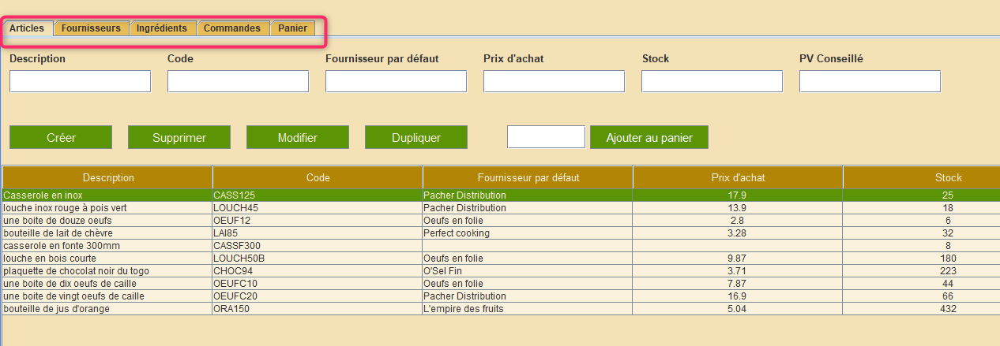

# Nesti Stock Management

Database settings and importable SQL files are in the "database_settings" folder in project root.

The first window that shows when opening the application is the login page:

Test user login: erik

Test user password: 1234

The user stays connected between app sessions, until the "disconnect" button is clicked:

After logging in, the main window is shown, with several open tabs each containing a directory of items (shown below is the articles directory).

A search bar can be found at the top of each directory tab. It is possible to filter the list of items by value for a single column

...or to combine search filters for multiple columns:

Table columns can be sorted by clicking on their headers:

It is possible to add an article to the shopping cart

It can then be seen by clicking the "Shopping cart" tab. If it had already existed in the cart prior to being added, its quantity would've been incremented.

Both the article quantity and the chosen supplier can be changed from within the shopping cart:

The totals are automatically updated when any item in the cart changes:

Orders can be 

When clicking on an individual list item (for example "article"), editable fields are shown:

When clicking on an individual list item (for example "article"), editable fields are shown:

Invalid fields become orange in real-time as the user types:

If an item contains a list of associations, items can be added by clicking on the "plus" button:

...and deleted by clicking on the "minus" button:

Similar information tabs can be found for each directory. Shown here is an order's information:

...a supplier's

...and an ingredient's:

